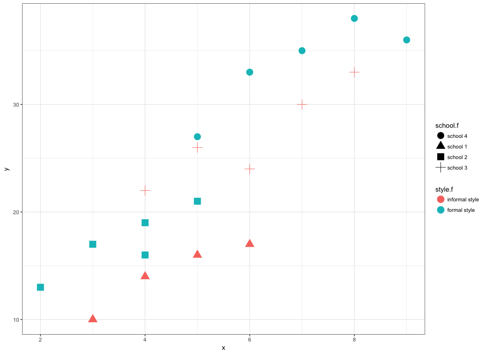
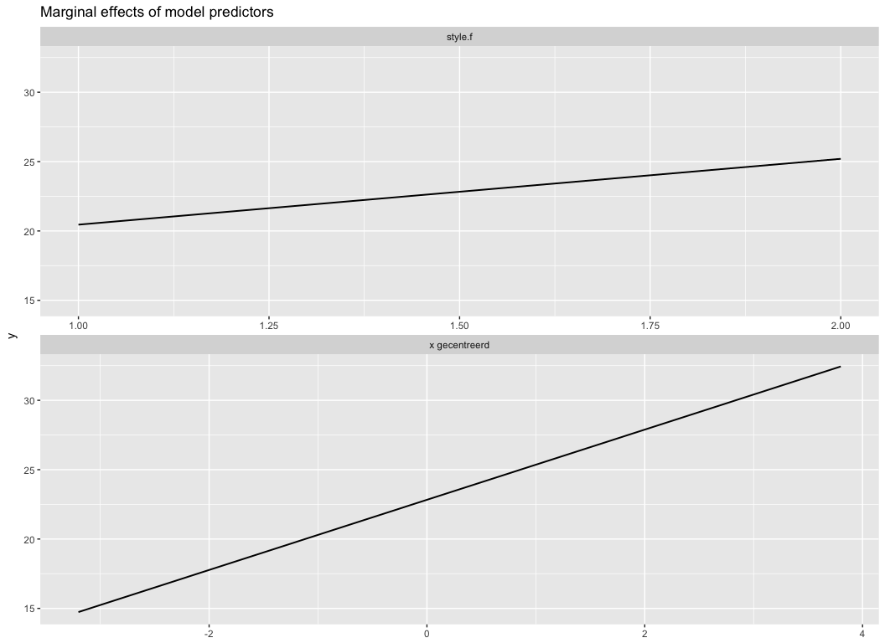

# Generalized Mixed Models
Fred Hasselman  
02/06/2017  


# **Introduction to the GMM family**

Many different terms are used to describe some form of the hierarchical *Generalized Mixed Model* family of statistical models, or *GeMMs*  for short (pronounce like the precious stones, *gems*). 

## What's in a name?

* _Generalized_ refers to the fact that we can use any distribution from [the exponential family](https://en.wikipedia.org/wiki/Exponential_family#Table_of_distributions) as a model for our response variable(s), because we know the [functions that link](https://en.wikipedia.org/wiki/Hierarchical_generalized_linear_model#Models_with_different_distributions_and_link_functions) the parameters of those distributions. 
* _Mixed_ refers to possibility to have different types of effects in the model, *fixed* and *random* effects.
    + Random effect structures can be used to model dependencies in the data ([heteroscedasticity](http://www.dummies.com/education/economics/econometrics/how-to-distinguish-between-homoskedastic-and-heteroskedastic-disturbances/)) that affects the eficiency and accuracy of OLS estimators.
    + Random effect structures can be *simple*, *autoregressive*, hierarchically *nested*, *cross-classified*, of the *multiple membership* kind or any combination of those. 
* _GeMMs_ can be *linear* or *nonlinear* models, and to estimate model parameters (OLS cannot be used) different methods are available; *Maximum Likelihood* estimators, *MCMC* and *Bayesian* methods. There are also extensions based on *vector autoregression (VAR)* and *LASSO*.


### When to use GeMMs? {-}

**Always**  

Well, ok, have a look at the different [multilevel structures one can encounter in real data](http://www.bristol.ac.uk/cmm/learning/multilevel-models/data-structures.html)


### Why? {-}

The *General Linear Model*  (the classical regression models and ANOVA variations) are just special cases of GeMMs in which the following assumptions hold (cf. Field):

* _Linear additivity_ of effects
* _Normality_ something or other
* _Homogeneity_ of variance
* _Independence_ of observations

For real world data, especially in the social and life sciences, at least one of those assumptions will be violated. So the answer to the *Why?* question is: **Because we need more realistic statistical models!**.

## `R` packages

We'll use the `lme4` package and some additional tools.

On thing you will notice is that `lme4` no longer provides p-values for fixed effects, here's what the authors have to say about it:

>  One of the most frequently asked questions about 'lme4' is "how do I calculate p-values for estimated parameters?" Previous versions of `lme4` provided the `mcmcsamp` function, which efficiently generated a Markov chain Monte Carlo sample from the posterior distribution of the parameters, assuming flat (scaled likelihood) priors. Due to difficulty in constructing a version of 'mcmcsamp' that was reliable even in cases where the estimated random effect variances were near zero (e.g. <https://stat.ethz.ch/pipermail/r-sig-mixed-models/2009q4/003115.html> `mcmcsamp` has been withdrawn (or more precisely, not updated to work with `lme4` versions greater than 1.0.0).


```r
install.packages(c("lme4","lmerTest","pbkrtest","nlme","sjPlot"), dependencies = TRUE, repos = "https://cloud.r-project.org")
```


We'll also use some standard packages for plotting data and model results.

```r
install.packages(c("lattice","latticeExtra","ggplot2","gridExtra","scales"), dependencies = TRUE, repos = "https://cloud.r-project.org")
```


These libraries are not essential, but generally will enhance you `R` experience.

```r
install.packages(c("plyr","tidyverse","rio"), dependencies = TRUE, repos = "https://cloud.r-project.org")
```


## Online sources

Here is a (non-exhaustive) list of great sources:

* [lme4: Mixed-effects modeling with R (Bates)](http://lme4.r-forge.r-project.org/lMMwR/lrgprt.pdf)
    + [lme4 vignette](https://cran.r-project.org/web/packages/lme4/vignettes/lmer.pdf)
    + [Mixed models in R using `lme4` and `nlme`](https://socserv.socsci.mcmaster.ca/jfox/Books/Companion/appendix/Appendix-Mixed-Models.pdf)
    + [Writing up *lmer* results](https://web.stanford.edu/class/psych253/section/section_8/lmer_examples.html)
    + [Getting started with mixed effect models in r (Knowles, R-bloggers)](https://www.r-bloggers.com/getting-started-with-mixed-effect-models-in-r/)
    + [General guide to mixed models in r](http://ase.tufts.edu/gsc/gradresources/guidetomixedmodelsinr/mixed%20model%20guide.html)
* [Center for multilevel modeling](http://www.bristol.ac.uk/cmm/)
    + From the creators of MLwiN
* [Multilevel Analysis (Hox)](https://stats.idre.ucla.edu/other/examples/ma-hox/)
    + Code examples from book in `HLM`, `SAS`, `Stata`, `R`
* [Introduction to Multilevel Modeling (Kreft & de Leeuw)](https://stats.idre.ucla.edu/other/examples/imm/)
    + Code examples from book in `HLM`, `R`, `SPSS`, `Mplus`, `SAS`, `Stata`
* [Applied Longitudinal Data Analysis (Singer & Willett)](https://stats.idre.ucla.edu/other/examples/alda/)
    + Code examples from book in `R`, `SPSS`, `Mplus`, `SAS`, `Stata`
* [Using lme/lmer to fit 2 and 3 level longitudinal models (Rpsychologist)](http://rpsychologist.com/r-guide-longitudinal-lme-lmer)
    + Excellent site with many examples
* [Inferential Methods for Linear Mixed Models](http://www.maths.bath.ac.uk/~jjf23/mixchange/index.html)
    + Includes examples for multivariate mutilevel modeling
* [R to MLwiN](https://www.jstatsoft.org/article/view/v072i10)
* [Power Analysis for Random Effects Models (Westfall)](http://jakewestfall.org/publications/JWK_AnnRev.pdf)
    + Provides `R`, `SPSS` and `SAS` code
    + Also see the [online tool](https://jakewestfall.shinyapps.io/two_factor_power/) and [additional topics supplement](http://jakewestfall.org/publications/JWK_AnnRev_Appendix.pdf)
* [Stan. Bayesian inference for multilevel GLMMs and more](http://mc-stan.org/interfaces/)
* [Generalized Additive Mixed Models (GAMM) for for modeling timeseries data](http://www.sfs.uni-tuebingen.de/~jvanrij/Tutorial/GAMM.html)
    + [Examples](http://www.sfs.uni-tuebingen.de/~hbaayen/publications/supplementCave.pdf)
* [Multilevel Analysis (Snijder & Boskers)](https://stats.idre.ucla.edu/other/examples/ma-snijders/)
    + Code examples from book in `HLM`, `Mplus`, `SAS`, `Stata`


# Classical linear regression  {.tabset .tabset-fade .tabset-pills}  

OLS regression of the example on the slides.

## Assignment
 
Let's repeat the example form the slides. Import the data from [Github](https://github.com/FredHasselman/Mixedmodels/tree/master/Cologne/AssignmentData), or run the code below and load it directly into R^[Importing SPSS files into R can sometimes lead to strange behaviour, because SPSS assigns both *variable* and *value* labels, which most software packages cannot handle. If you can't get rid of the labels, use `rio::export(df,"filename.ext")` and set `.ext` to `.csv` or `.xlsx`, then reload the file using `df <- rio::import("filename.ext")`].


```r
library(rio)
df <- rio::import("https://github.com/FredHasselman/Mixedmodels/raw/master/Cologne/AssignmentData/IntroductionData.sav")

# Change some variables to nominal factors
df$student.f <- factor(df$student)
df$school.f  <- factor(df$school, levels = 1:4, labels = paste("school",1:4))
df$style.f   <- factor(df$style, levels = c(-.5,.5), labels = c("informal style","formal style"))

# To mimic the slides, we analyse relative to school 4
df$school.f <- relevel(df$school.f, ref = "school 4")
```

### Look at the data. 

+ Plot language ability `x` (at the start of the year) against `y` (at the end of the year) and mark each school with a shape or colour. 
+ If you are new to `R`, just look at the solution and copy and run the code. Plot the predicted values.

### Fit the global model.
Using the basic `R` stats functions we can fit a regression model for the entire sample: $Y_{i} = \beta_{0} + \beta_{1} X_{i} + \varepsilon_{i},\ \text{with}\ i = 1,2,\ldots,20$.

+ Use the function `lm`. 
+ If you are unfamiliar with the function, look at the manual entry by typing `?lm` in the console.
+ Plot the predicted values.

### Fit the model with intercepts for schools.

This means adding the `school.f` variable. The use of factors in `R` is very convenient, you do not have to create dummy variables, `R` will do this for you. So we are looking for a model of the type: $Y_{i} = \beta_{0j} + \beta_{1} X_{ij} + \varepsilon_{ij},\ \text{with}\ i = 1,2,\ldots,20\ \text{and}\ j = 1,2,\ldots,4$. 

+ Plot the predicted values.

### Fit the model with intercepts for teaching style.

To fit the model with an intercept for each teaching style, we simply add the factor `style.f` variable. So we are looking for a model of the type: $Y_{ij} = \beta_{0k} + \beta_{1} X_{ik} + \varepsilon_{ik},\ \text{with}\ i = 1,2,\ldots,20\ \text{and}\ k = 1,2$. 

+ On the slides, the model was fitted to the grand-mean centered version of `x`. We will get back to centering data, the variable is in the dataset as `xc`. You could also calculate the variable yoursef using the function `scale`:

```r
df$xc <- scale(df$x, scale = FALSE)
```

+ Plot the predicted values.

### Fit the model with both school and teaching style effects.

To fit the model with both `school` and `teaching style` effects and just 1 random error term, we need dummy variables. They are already in the dataset. We should get a model of the type: $Y_{i} = \beta_{0} + \beta_{1} X_{i} + \beta_{2}\ Style_{i} + \beta_{3}\ d1_{i} + \beta_{4}\ d2_{i} +  \varepsilon_{i},\ \text{with}\ i = 1,2,\ldots,20$.

+ Plot the predicted values.

### Compare the models using the function `anova()`.


## Solution

### Plot the data

```r
# Using ggplot2
library(ggplot2)
ggplot(df, aes(x=x,y=y,group=school.f)) +
  geom_point(aes(colour=style.f,shape=school.f), size=5) +
  theme_bw() 
```

<!-- -->

### Fit the global model.

```r
# Fit the model and display a summary of the results
fit1 <- lm(y ~ x, data=df)
summary(fit1)
```

```

Call:
lm(formula = y ~ x, data = df)

Residuals:
    Min      1Q  Median      3Q     Max 
-9.1517 -2.8425 -0.6517  3.6893  6.8483 

Coefficients:
            Estimate Std. Error t value Pr(>|t|)    
(Intercept)   1.3887     2.9016   0.479    0.638    
x             4.1272     0.5254   7.855 3.17e-07 ***
---
Signif. codes:  0 '***' 0.001 '**' 0.01 '*' 0.05 '.' 0.1 ' ' 1

Residual standard error: 4.371 on 18 degrees of freedom
Multiple R-squared:  0.7742,	Adjusted R-squared:  0.7616 
F-statistic: 61.71 on 1 and 18 DF,  p-value: 3.175e-07
```

```r

# Plot fit 1
df$pred1 <- predict(fit1)
ggplot(df, aes(x=x,y=pred1, colour = school.f, shape=school.f)) +
  geom_point(aes(y=y)) +
  geom_line(aes(group=school.f)) +
  ggtitle("Model 1", subtitle = fit1$call) +
  theme_bw()
```

<!-- -->

### Fit the model with intercepts for schools.

```r
# Fit the model and display a summary of the results
fit2 <- lm(y ~ x + school.f, data=df)
summary(fit2)
```

```

Call:
lm(formula = y ~ x + school.f, data = df)

Residuals:
    Min      1Q  Median      3Q     Max 
-3.0000 -0.5531  0.4750  1.1438  1.7625 

Coefficients:
                 Estimate Std. Error t value Pr(>|t|)    
(Intercept)       16.7375     2.1667   7.725 1.32e-06 ***
x                  2.4375     0.2911   8.373 4.89e-07 ***
school.fschool 1 -13.5750     1.3225 -10.265 3.54e-08 ***
school.fschool 2  -8.3125     1.4368  -5.786 3.59e-05 ***
school.fschool 3  -4.3625     1.0814  -4.034  0.00108 ** 
---
Signif. codes:  0 '***' 0.001 '**' 0.01 '*' 0.05 '.' 0.1 ' ' 1

Residual standard error: 1.647 on 15 degrees of freedom
Multiple R-squared:  0.9733,	Adjusted R-squared:  0.9662 
F-statistic: 136.6 on 4 and 15 DF,  p-value: 1.317e-11
```

```r

# Plot fit 2
df$pred2 <- predict(fit2)
ggplot(df, aes(x=x,y=pred2, colour = school.f, shape=school.f)) +
  geom_point(aes(y=y)) +
  geom_line(aes(group=school.f)) +
  ggtitle("Model 2", subtitle = fit2$call) +
  theme_bw()
```

<!-- -->

### Fit the model with intercepts for teaching style.

```r
# Fit the model and display a summary of the results
fit3 <- lm(y ~ xc + style.f, data=df)
summary(fit3)
```

```

Call:
lm(formula = y ~ xc + style.f, data = df)

Residuals:
    Min      1Q  Median      3Q     Max 
-6.8561 -2.1189  0.4936  2.2097  6.2686 

Coefficients:
                    Estimate Std. Error t value Pr(>|t|)    
(Intercept)          20.6062     1.1975  17.208 3.44e-12 ***
xc                    4.0623     0.4556   8.917 8.08e-08 ***
style.fformal style   4.4875     1.6948   2.648   0.0169 *  
---
Signif. codes:  0 '***' 0.001 '**' 0.01 '*' 0.05 '.' 0.1 ' ' 1

Residual standard error: 3.784 on 17 degrees of freedom
Multiple R-squared:  0.8401,	Adjusted R-squared:  0.8213 
F-statistic: 44.66 on 2 and 17 DF,  p-value: 1.707e-07
```

```r

# Plot fit 3
df$pred3 <- predict(fit3)
ggplot(df, aes(x=xc,y=pred3,colour=style.f,shape=school.f)) +
  geom_point(aes(y=y)) +
  geom_line(aes()) +
  ggtitle("Model 3", subtitle = fit3$call) +
  theme_bw()
```

<!-- -->

### Fit the model with an both school and teaching style effects.

```r
# Fit the model and display a summary of the results
fit4 <- lm(y ~ xc + style.f + d1 + d2, data=df)
summary(fit4)
```

```

Call:
lm(formula = y ~ xc + style.f + d1 + d2, data = df)

Residuals:
    Min      1Q  Median      3Q     Max 
-3.0000 -0.5531  0.4750  1.1438  1.7625 

Coefficients:
                    Estimate Std. Error t value Pr(>|t|)    
(Intercept)          20.4438     0.5215  39.198  < 2e-16 ***
xc                    2.4375     0.2911   8.373 4.89e-07 ***
style.fformal style   4.8125     0.7387   6.515 9.78e-06 ***
d1                    4.6063     0.5829   7.902 1.00e-06 ***
d2                    4.1562     0.7184   5.786 3.59e-05 ***
---
Signif. codes:  0 '***' 0.001 '**' 0.01 '*' 0.05 '.' 0.1 ' ' 1

Residual standard error: 1.647 on 15 degrees of freedom
Multiple R-squared:  0.9733,	Adjusted R-squared:  0.9662 
F-statistic: 136.6 on 4 and 15 DF,  p-value: 1.317e-11
```

```r

# Plot fit 4
df$pred4 <- predict(fit4)
ggplot(df, aes(x=xc,y=pred4,shape=style.f,colour=school.f)) +
  geom_point(aes(y=y)) +
  geom_line() +
  ggtitle("Model 4", subtitle = fit4$call) +
  theme_bw()
```

<!-- -->

### Compare model fit

```r
# Compare the models
anova(fit1,fit2, fit3, fit4)
```

```
Analysis of Variance Table

Model 1: y ~ x
Model 2: y ~ x + school.f
Model 3: y ~ xc + style.f
Model 4: y ~ xc + style.f + d1 + d2
  Res.Df    RSS Df Sum of Sq      F    Pr(>F)    
1     18 343.83                                  
2     15  40.68  3    303.16 37.266 3.421e-07 ***
3     17 243.43 -2   -202.76 37.386 1.486e-06 ***
4     15  40.67  2    202.76 37.386 1.486e-06 ***
---
Signif. codes:  0 '***' 0.001 '**' 0.01 '*' 0.05 '.' 0.1 ' ' 1
```


# Variance Components  {.tabset .tabset-fade .tabset-pills}  

Now we will start using random effects...

## Assignment 

### The empty multilevel model

Fit a model that considers the variation in the intercepts of the schools as a random variation around the grand mean.

+ Schools are Level 2: We assume the school intercepts can be considered to be drawn from a normal distribution with $\mu = 0$ and unknown $\sigma_{u}^2$. Parameter $\sigma_{u}^2$ will be estimated from the data. 
+ Student scores will be considered to vary randomly around the mean of their respective schools. We will assume students in each school vary around the school mean in the same way, a normal distribution with $\mu = 0$ and unknown $\sigma_{e}^2$.
+ Use the function `lmer()` to model the data. It looks similar to `lm()` but you need to specify the random effect structure. Look at the manual, or if you can't get it to work, at the solutions.

### Adding the random effect structure

+ Add student as a random level: `(1|student.f)` and fit the model
    - The `1` refers to a constant, an intercept
    - The variable after `|` is the variable that groups togethter the data on this level.
+ Add school as a random level: `(1|student.f) + (1}school.f)` and fit the model
+ Indicate that students are in fact nested within schools: `(1|school.f/student.f)`
     - There are more ways this can be achieves see 


### Add teaching style as a factor.

+ Compare the the single level model to the variance components model


## Solution

### The empty multilevel model

Variance components, seperate random effects for students and schools.

```r
library(lme4)
library(lmerTest)

# Only students
fit50 <- lmer(y ~ (1|student.f) ,data = df)
summary(fit50)
```

```
Linear mixed model fit by REML ['lmerMod']
Formula: y ~ (1 | student.f)
   Data: df

REML criterion at convergence: 138.6

Scaled residuals: 
     Min       1Q   Median       3Q      Max 
-0.85816 -0.25410 -0.00844  0.34250  0.55385 

Random effects:
 Groups    Name        Variance Std.Dev.
 student.f (Intercept) 72.697   8.526   
 Residual               8.025   2.833   
Number of obs: 20, groups:  student.f, 19

Fixed effects:
            Estimate Std. Error t value
(Intercept)   23.240      2.058   11.29
```

```r

fit5a <- lmer(y ~ (1|school.f) + (1|student.f) ,data = df)
summary(fit5a)
```

```
Linear mixed model fit by REML ['lmerMod']
Formula: y ~ (1 | school.f) + (1 | student.f)
   Data: df

REML criterion at convergence: 117.6

Scaled residuals: 
    Min      1Q  Median      3Q     Max 
-1.2420 -0.5947  0.1494  0.5248  1.1867 

Random effects:
 Groups    Name        Variance Std.Dev.
 student.f (Intercept)  6.636   2.576   
 school.f  (Intercept) 82.043   9.058   
 Residual               7.987   2.826   
Number of obs: 20, groups:  student.f, 19; school.f, 4

Fixed effects:
            Estimate Std. Error t value
(Intercept)   22.935      4.612   4.973
```

Variance components with students nested within schools.

```r

fit5b <- lmer(y ~ (1|school.f/student.f) ,data = df)
summary(fit5a)
```

```
Linear mixed model fit by REML ['lmerMod']
Formula: y ~ (1 | school.f) + (1 | student.f)
   Data: df

REML criterion at convergence: 117.6

Scaled residuals: 
    Min      1Q  Median      3Q     Max 
-1.2420 -0.5947  0.1494  0.5248  1.1867 

Random effects:
 Groups    Name        Variance Std.Dev.
 student.f (Intercept)  6.636   2.576   
 school.f  (Intercept) 82.043   9.058   
 Residual               7.987   2.826   
Number of obs: 20, groups:  student.f, 19; school.f, 4

Fixed effects:
            Estimate Std. Error t value
(Intercept)   22.935      4.612   4.973
```


### Add pre-measure and teachig style

```r
# Add teaching style
fit5c <- lmer(y ~ xc + style.f + (1|school.f/student.f) ,data = df)
summary(fit5c)
```

```
Linear mixed model fit by REML 
t-tests use  Satterthwaite approximations to degrees of freedom ['lmerMod']
Formula: y ~ xc + style.f + (1 | school.f/student.f)
   Data: df

REML criterion at convergence: 81.7

Scaled residuals: 
    Min      1Q  Median      3Q     Max 
-1.2021 -0.4341  0.1621  0.4484  0.8050 

Random effects:
 Groups             Name        Variance Std.Dev.
 student.f:school.f (Intercept)  1.482   1.217   
 school.f           (Intercept) 36.561   6.047   
 Residual                        1.309   1.144   
Number of obs: 20, groups:  student.f:school.f, 19; school.f, 4

Fixed effects:
                    Estimate Std. Error      df t value Pr(>|t|)    
(Intercept)          20.4529     4.3082  1.9360   4.747   0.0443 *  
xc                    2.5294     0.2948 14.7440   8.580 4.09e-07 ***
style.fformal style   4.7521     6.0950  1.9390   0.780   0.5194    
---
Signif. codes:  0 '***' 0.001 '**' 0.01 '*' 0.05 '.' 0.1 ' ' 1

Correlation of Fixed Effects:
            (Intr) xc    
xc           0.007       
styl.ffrmls -0.707 -0.014
```

### Compare the models

```r
anova(fit50,fit5a,fit5b,fit5c)
```

```
Data: df
Models:
object: y ~ (1 | student.f)
..1: y ~ (1 | school.f) + (1 | student.f)
..2: y ~ (1 | school.f/student.f)
..3: y ~ xc + style.f + (1 | school.f/student.f)
       Df    AIC    BIC  logLik deviance  Chisq Chi Df Pr(>Chisq)    
object  3 147.88 150.87 -70.942  141.884                             
..1     4 130.38 134.36 -61.188  122.376 19.508      1  1.002e-05 ***
..2     4 130.38 134.36 -61.188  122.376  0.000      0          1    
..3     6 101.75 107.72 -44.873   89.745 32.631      2  8.210e-08 ***
---
Signif. codes:  0 '***' 0.001 '**' 0.01 '*' 0.05 '.' 0.1 ' ' 1
```


### Diagnostic plots


```r
# Using plot
plot(fit5c, resid(., scaled=TRUE) ~ fitted(.) | style.f, abline = 0)
```

<!-- -->

```r

# box-plots of residuals by school
plot(fit5c, school.f ~ resid(., scaled=TRUE))
```

<!-- -->

```r
# observed versus fitted values by school
plot(fit5c, y ~ fitted(.) | school.f, abline = c(0,1))
```

<!-- -->

```r
# residuals by x, separated by school
plot(fit5c, resid(., scaled=TRUE) ~ x | school.f, abline = 0)
```

<!-- -->

```r

# Use package lattice
require("lattice")
qqmath(fit5c, id=0.05)
```

<!-- -->

### Profiling


```r
pr <- profile(fit5c, optimizer="Nelder_Mead", which="beta_")

# Profiled confidence intervals
(confint(pr) -> CIpr)
```

```
                        2.5 %    97.5 %
(Intercept)         12.775993 28.125883
xc                   1.964605  3.345726
style.fformal style -6.098200 15.617406
```

```r
# Zeta functions
xyplot(pr, absVal=TRUE)
```

<!-- -->

```r
xyplot(pr, conf = c(0.95, 0.99), main = "95% and 99% profile() intervals")
```

<!-- -->

```r
# Density plots
densityplot(pr, main="densityplot( profile(lmer(..)) )")
```

<!-- -->

```r
# correlation matrix
splom(pr)
```

<!-- -->

### Plot random and fixed effects 

Use the `strenge jacke` package ([sjPlot](http://www.strengejacke.de/sjPlot/sjp.lmer/)).

```r
library(sjPlot)
# Random effects
sjp.lmer(fit5c, sort.est = "sort.all", facet.grid = FALSE)
```

<!-- --><!-- -->

```r

# Plot fixed effects
sjp.lmer(fit5c, type = "fe")
```

<!-- -->

```r

# Plot fixed effects
sjp.lmer(fit5c, type = "fe")
```

<!-- -->

```r

# Plot standardised fixed effects
sjp.lmer(fit5c, type = "fe.std")
```

<!-- -->

```r

# plot fixed effects slopes
sjp.lmer(fit5c, type = "fe.slope", vars = c("xc", "style.f"))
```

<!-- --><!-- -->

```r

# plot effects
sjp.lmer(fit5c, type = "eff")
```

<!-- -->

```r

# plot effects
sjp.lmer(fit5c, type = "pred", vars = "xc")
```

<!-- -->

```r
sjp.lmer(fit5c, type = "pred", vars = "style.f")
```

<!-- -->

```r

# plot effects
sjp.lmer(fit5c, type = "pred", vars = c("xc", "style.f"))
```

<!-- -->

```r

# plot effects
sjp.lmer(fit5c, type = "pred", 
         facet.grid = FALSE, 
         vars = c("xc", "style.f"))
```

<!-- -->

```r

# plot fixed effects depending on group levels
sjp.lmer(fit5c, type = "ri.slope")
```

<!-- --><!-- --><!-- --><!-- -->

```r

# plot fixed effects correlation matrix
sjp.lmer(fit5c, type = "fe.cor")
```

<!-- -->

```r

# plot qq-plot of random effects
sjp.lmer(fit5c, type = "re.qq")
```

<!-- -->


# Random intercepts & slopes {.tabset .tabset-fade .tabset-pills}  

Random intercepts & slopes

## Assignment 

### Teaching style

+ Try to see whether teaching style explains slope variance of schools.

+ Our dataset is too small!


## Solution

### Teaching style


```r
# Add teaching style as a random slope
fit5d <- lmer(y ~ xc + style.f + (style.f |school.f/student.f) ,data = df)
summary(fit5d)
```


```r
# This does work
fit5d <- lmer(y ~ xc  + (xc |school.f) ,data = df)
summary(fit5d)
```

```
Linear mixed model fit by REML 
t-tests use  Satterthwaite approximations to degrees of freedom ['lmerMod']
Formula: y ~ xc + (xc | school.f)
   Data: df

REML criterion at convergence: 87.8

Scaled residuals: 
    Min      1Q  Median      3Q     Max 
-1.7989 -0.3788  0.2166  0.6738  1.1152 

Random effects:
 Groups   Name        Variance  Std.Dev. Corr 
 school.f (Intercept) 3.214e+01 5.66915       
          xc          8.153e-04 0.02855  -1.00
 Residual             2.714e+00 1.64733       
Number of obs: 20, groups:  school.f, 4

Fixed effects:
            Estimate Std. Error      df t value Pr(>|t|)    
(Intercept)  22.8784     2.8584  2.9170   8.004   0.0045 ** 
xc            2.5018     0.2883 15.5630   8.678 2.35e-07 ***
---
Signif. codes:  0 '***' 0.001 '**' 0.01 '*' 0.05 '.' 0.1 ' ' 1

Correlation of Fixed Effects:
   (Intr)
xc -0.050
```

